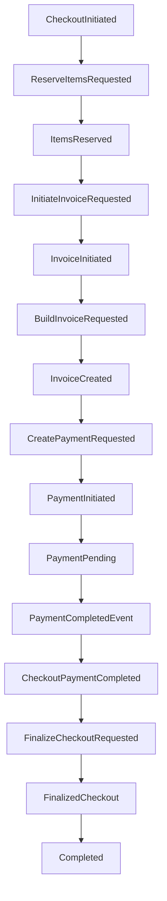

# Checkout Saga README

This document explains what happens inside the MassTransit checkout saga at each step.

Primary files:

```text
Skyress.Application/Checkout/Sagas/CheckoutStateMachine.cs
Skyress.Application/Checkout/Sagas/CheckoutSagaData.cs
Skyress.Application/Checkout/Events/RequestEvents.cs
Skyress.Application/Checkout/Events/ResultEvents.cs
Skyress.Application/Checkout/Sagas/Consumers/
Skyress.Infrastructure/Saga/SagaConfigurator.cs
```

## Saga State

The saga stores:

- `CorrelationId`: saga identity.
- `CurrentState`: MassTransit state name.
- `BasketId`: basket being checked out.
- `InvoiceId`: invoice created during checkout.
- `PaymentId`: payment created during checkout.

The correlation id is also stored on the basket as `CheckoutId` so a payment completion can be mapped back to the correct saga.

## Message Flow



## Step By Step

### 1. Checkout Initiated

Event:

```text
CheckoutInitiated(CorrelationId, BasketId)
```

State machine behavior:

- Starts a new saga instance or correlates with an existing one.
- Stores the basket id.
- Publishes `ReserveItemsRequested`.
- Transitions to `ReservingItems`.

### 2. Reserve Items Requested

Consumer:

```text
ReserveItemsRequestedConsumer
```

Command:

```text
ReserveItemsCommand(BasketId)
```

Behavior:

- Loads the basket and item lines.
- Reserves inventory through application/domain logic.
- Publishes `ItemsReserved` when successful.
- Throws if reservation fails, allowing MassTransit retry behavior to apply.

### 3. Items Reserved

Event:

```text
ItemsReserved(CorrelationId)
```

State machine behavior:

- Publishes `InitiateInvoiceRequested`.
- Transitions to `InitiatingInvoice`.

### 4. Initiate Invoice Requested

Consumer:

```text
InitiateInvoiceRequestedConsumer
```

Command:

```text
CreateInvoiceCommand(BasketId)
```

Behavior:

- Creates or resolves the invoice for the basket.
- Publishes `InvoiceInitiated` with the invoice id.

### 5. Invoice Initiated

Event:

```text
InvoiceInitiated(CorrelationId, InvoiceId)
```

State machine behavior:

- Stores the invoice id in saga data.
- Publishes `BuildInvoiceRequested`.
- Transitions to `BuildingInvoice`.

### 6. Build Invoice Requested

Consumer:

```text
BuildInvoiceRequestedConsumer
```

Command:

```text
BuildInvoiceFromBasketCommand(InvoiceId, BasketId)
```

Behavior:

- Copies basket lines into invoice sold items.
- Calculates invoice totals.
- Publishes `InvoiceCreated`.

### 7. Invoice Created

Event:

```text
InvoiceCreated(CorrelationId)
```

State machine behavior:

- Publishes `CreatePaymentRequested`.
- Transitions to `InitiatingPayment`.

### 8. Create Payment Requested

Consumer:

```text
CreatePaymentRequestedConsumer
```

Command:

```text
CreatePaymentCommand(InvoiceId, Cash)
```

Behavior:

- Creates a cash payment for the invoice.
- Publishes `PaymentInitiated` with the payment id.

### 9. Payment Initiated

Event:

```text
PaymentInitiated(CorrelationId, PaymentId)
```

State machine behavior:

- Stores the payment id in saga data.
- Transitions to `PaymentPending`.
- Waits for the external cash payment completion endpoint to be called.

### 10. Cash Payment Completed

External command:

```text
CompleteCashPaymentCommand(PaymentId, TotalPaid)
```

Published event:

```text
PaymentCompletedEvent(PaymentId)
```

Bridge consumer:

```text
PaymentCompletedConsumer
```

Behavior:

- Finds the invoice by payment id.
- Finds the basket by invoice basket id.
- Reads the basket checkout id.
- Publishes `CheckoutPaymentCompleted(CorrelationId)`.

### 11. Checkout Payment Completed

Event:

```text
CheckoutPaymentCompleted(CorrelationId)
```

State machine behavior:

- Publishes `FinalizeCheckoutRequested`.
- Transitions to `Finalizing`.

### 12. Finalize Checkout Requested

Consumer:

```text
FinalizeCheckoutConsumer
```

Commands:

```text
UpdateInvoiceStateCommand(InvoiceId, Paid)
CompleteCheckoutCommand(BasketId)
MarkItemsAsSoldCommand(BasketId)
```

Behavior:

- Marks the invoice paid.
- Marks the basket checkout complete.
- Converts reserved item quantities into sold quantities.
- Publishes `FinalizedCheckout`.

### 13. Finalized Checkout

Event:

```text
FinalizedCheckout(CorrelationId)
```

State machine behavior:

- Transitions to `Completed`.
- Finalizes the saga instance.

## Duplicate And Late Messages

The state machine ignores duplicate or late messages after the saga has moved past the related state:

- Duplicate `CheckoutInitiated` is ignored after the saga starts.
- Late `ItemsReserved` is ignored after reservation has already advanced.
- Late `InvoiceInitiated`, `InvoiceCreated`, `PaymentInitiated`, and `CheckoutPaymentCompleted` are ignored after their expected states.

This protects the state machine from repeated message delivery. Durable side-effect idempotency still depends on database constraints and repository/application behavior.

## Retry Behavior

MassTransit is configured with:

- RabbitMQ transport.
- EF Core saga repository using PostgreSQL.
- In-memory outbox.
- Exponential retry: 3 attempts, from 1 second to 10 seconds with a 2 second interval delta.

Consumers throw on unrecoverable application failures today, so repeated failures can retry and eventually fault. Operational monitoring should watch failed/faulted messages and stuck saga states.

## Known Hardening Notes

- Invoice/payment/sold-item unique indexes exist in the hardening plan, but some repository conflict handling tasks remain open.
- Stock concurrency-safe persistence is still listed as open work.
- Refresh-token replay concurrency is part of the same hardening feature but is separate from the checkout saga.
